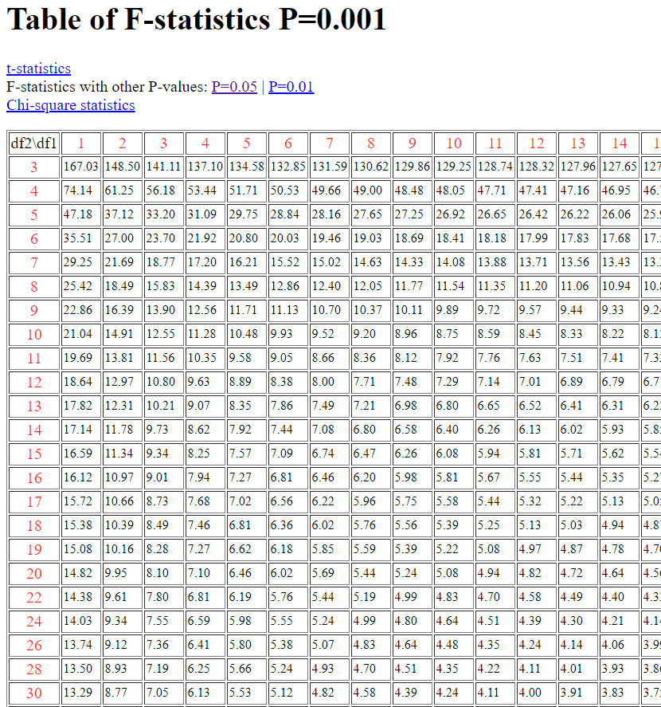

```{r setup, include=FALSE}
if (!require(kableExtra)){
        install.packages("kableExtra",dependencies = TRUE,repos=c(CRAN="https://cran.cnr.berkeley.edu/"))
}
library(knitr)
library(kableExtra)
options(knitr.table.format = "latex")
knitr::opts_chunk$set(echo = TRUE)
```

## Carga de datos

```{r, cache=TRUE}
algodon <- read.csv("algodon.csv", header = TRUE, row.names = 1)
```

Datos Cargados:

```{r, cache=TRUE}
kable(algodon)
```

## Limpieza de datos

Los datos cargados no cumplen con los estándares de _Tidy Data_ https://vita.had.co.nz/papers/tidy-data.pdf para el analisis, por lo que es necesario al menos hacer un cambio - cambiar las observaciones (experimentos) a filas, y mantener las variables independientes a columnas. Afortunadamente, esto lo podemos hacer facilmente haciendo la transpuesta:

```{r}
algodon_t <- as.data.frame(t(algodon))
kable(algodon_t)
```

## ANOVA

Calculo de ANOVA:

```{r, cache=TRUE}
algodon_stacked <- stack(algodon_t)
kable(algodon_stacked)
```
```{r, cache=TRUE}
anova_algodon <- aov(values ~ ind, data = algodon_stacked, qr = TRUE)
summary(anova_algodon)

```

```{r}
anova_algodon
```

De aquí podemos decir que:

$$F(4,20)=14.76, p < 0.001$$

Tenemos los grados de libertad $4$ (numerador) y $20$ (denominador), asi como un $p$ menor a $0.001$. Con estos datos podemos buscar en la tabla de Fischer para $p<0.001$:
\renewcommand{\figurename}{Fig.}
```{r, out.width="0.3\\linewidth", include=TRUE, fig.align="center", fig.cap=c("Tabla de Fisher p < 0.001"), echo=FALSE}

```
Tabla tomada de https://web.ma.utexas.edu/users/davis/375/popecol/tables/f0001.html

Para estos valores del _F-Test_, al buscarlos en la tabla nos da que el valor crítico es $7.10$. Nuestro _F-Test_ da un resultado de $14.76$, que es mayor que el valor crítico, lo que significa que al menos un tratamiento tiene un efecto medible sobre las observaciones y es un resutlado estadísticamente válido.

La explicación de lo anterior es:

ANOVA lo que hace es calcular varianzas. Estas varianzas nos indican cuan alejados estan los datos de la media, es decir, la dispersion de los datos. Entre mas grande sea la varianza, significa que los datos estan mas lejos.

El _F-test_ lo que indica es la razón entre las varianzas de las medias de la muestra y de las varianzas de los errores de las observaciones de la muestra. La idea es que la varianza de las medias deberia de ser similar a la varianza de las observaciones en caso que las diferencias de las observaciones sean por errores, dado que tienen el mismo origen. De no ser asi, la varianza de la menos un grupo de medias seria mucho mayor que la varianza entre las muestras, porque habria otro factor que esta afectando solamente a ese grupo.

Tomando el ejemplo visto en clase, si partimos que cada observación se compone de tres partes:

$$ y_{ij} = \mu + \tau_i + \epsilon_{ij} $$

$\mu$ = la media

$\tau$ = Efecto del í-ésimo tratamiento

$\epsilon$ = error de la observación

Tal y como vimos en clase, de esto podemos deducir dos hipotesis:

- Hipotesis nula $H_0$: los efectos de los tratamientos no no afectan, es decir, la media de todos los tratamientos es la misma, y todo puede ser explicado por $y_{ij} = \mu + \epsilon_{ij}$
- Hipotesis alternativa $H_1$: Los efectos de los tratamientos si afectan, por lo tanto en al menos un par de tratamientos $(i,j)$, $\mu_i \neq \mu_j$

Para probar estas hipotesis, ANOVA, como una forma intuitiva de entenderlo, lo que hace es calcular la dispersión de las medias, y dividirlas por la dispersion de todas las observaciones. Si $\tau_i=0 \forall i$, entonces la dispersion de todas las medias y la dispersion de todas las observaciones seria similar, y el _F test_ daría un valor inferior al valor crítico de la tabla de Fischer. De lo contrario daría un número mayor que este valor crítico.

Adicionalmente, ANOVA utiliza los _grados de libertad_. En el caso de variables categoricas, como en este caso, para las medias se calcula como uno menos que el numero de niveles $DF_k=k-1$. En el caso del error, se calcula como el numero de observaciones menos el numero de niveles (o grupos) usados $DF_n=n-k$.


El cálculo que realiza ANOVA es el siguiente:

$$

F=CMF

$$


- Lo llamado los _mean squares_. Estos son 

Esto se ve reflejado dentro de los datos en el objeto ANOVA:


